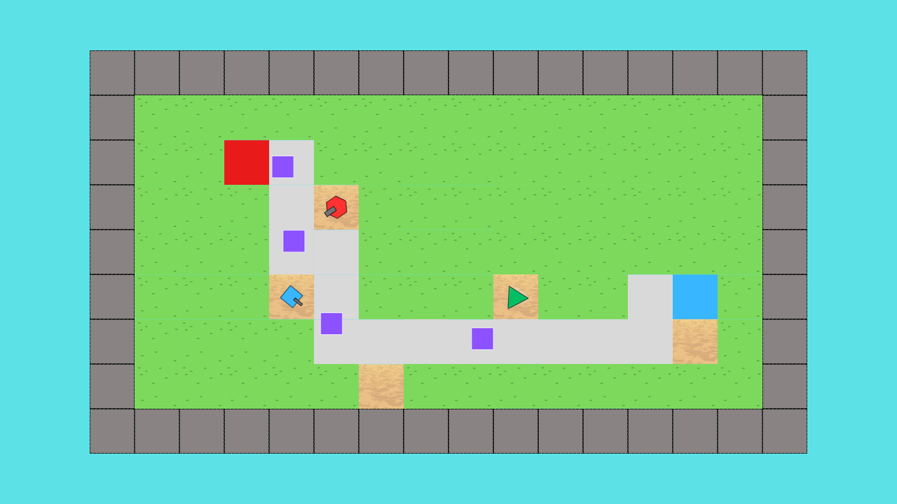

# Tower_defense
A 2D game made in Python using [Pyglet](https://pyglet.org). Are you bored of looking at towers? Do you want them to shoot some enemies and to hear some cool music?
We have the solution! Tower defense is a game containing simple shapes as buildings trying to save your base from being killed by unknown foes.



# How to play the game
You will need to install Pyglet[^1] before playing the game.

```
    pip install --upgrade --user pyglet
```

After open the [main.py](./src/main.py) and run it. Press ESC if you want to force quit the game.

# Map Editor
You can change the map however you want. In the [maps](./assets/maps) folder you will find 3 maps which can be edited however you want. What the numbers represent:
0. Enemy path
1. Sand (buildings can be placed there)
2. Grass (nothing can happen there)
3. Border (nothing can happen there)
4. Player base
5. Enemy base

# Objectives:
- [x] Find a good game engine
- [x] Find songs for the game
- [x] Find good sfx sounds
- [x] Find / Make textures or images
- [x] Make the main Menu
    - [x] Make an "exit" button
    - [x] Make a "settings" button
    - [x] Make a "play" button
    - [x] Finish the settings
    - [x] Add background
- [x] Make a map reader
- [x] Make a map drawer
- [x] Define buildings
- [x] Define enemies
- [x] Make buildings to attack enemies
- [x] Make small animations
- [x] Finish the README.md

[^1]: Pyglet isn't made by us. [Link](https://pyglet.org) to the official site.